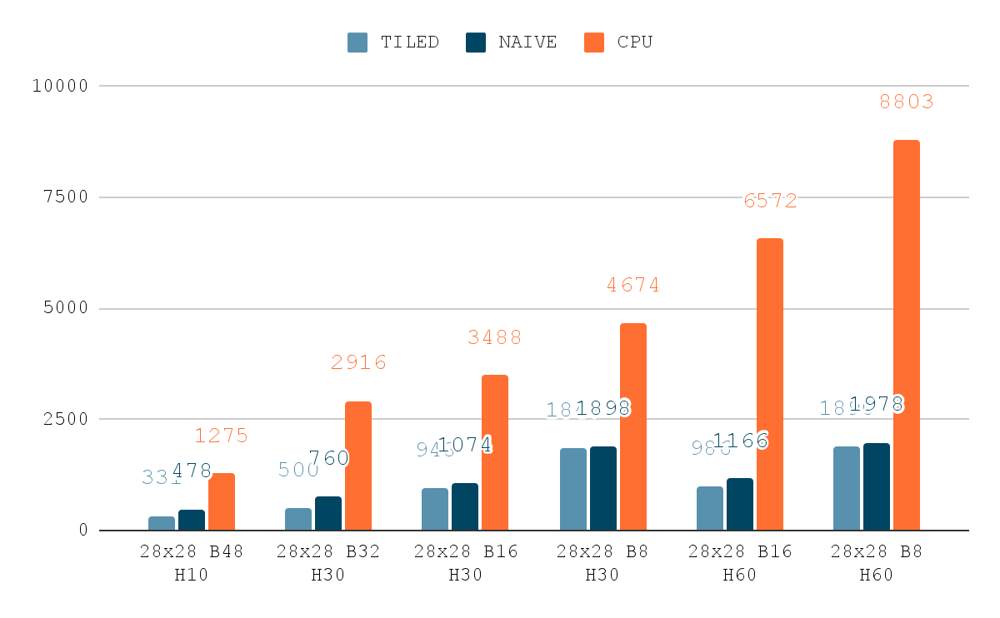
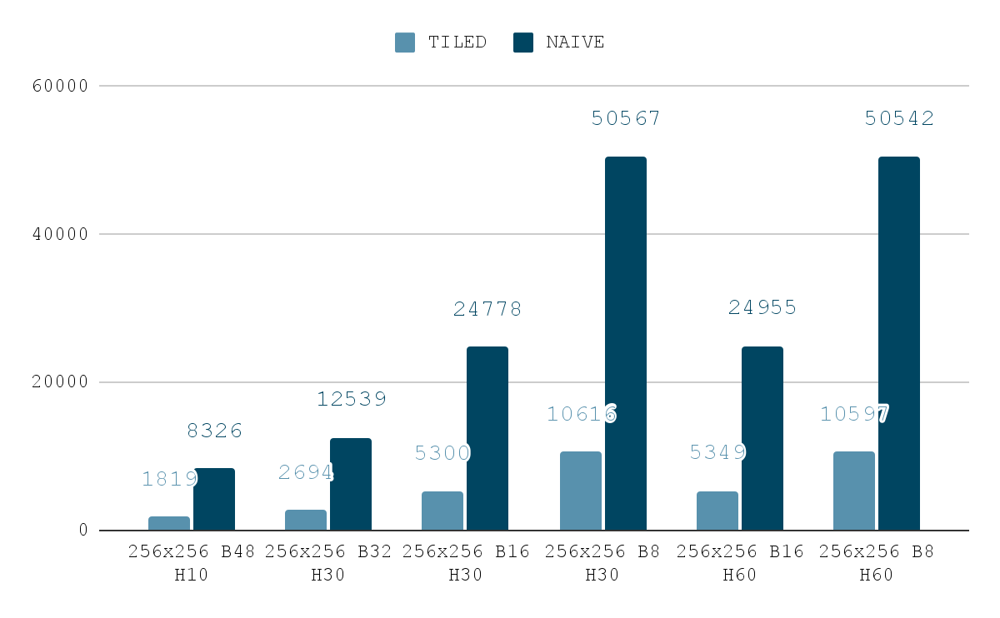

# CudaNN
Simple-to-use neural network framework written in C++ that utilizes CUDA cores on NVIDIA cards. In this example, the MNIST classification problem is solved using a multi-layer neural network with hyperbolic tangent as the activation function, mean squared error as loss function and stochastic gradient descent method as optimizer.

|CPU vs GPU|TILED vs NAIVE|
|:-:|:-:|
|||

### Neural Networks
Deep neural networks consist of:
- input layer
- $n$ hidden layers
- output layer

They can be used in classification or regression problems.

### General idea
Algorithm can be summarized as follows:
1. Initalize weights and biases (using pseudo-random generator with uniform distribution between $-0.5$ and $0.5$),
2. Prepare input data and divide them into batches,
3. Perform the forward step,
4. Calculate error,
5. Perform the backward step,
6. Update weights and biases,
7. Return to step $3$

### Minimalize loss function
To minimalize loss function, stochastic gradient descent method is implemented.

Loss function is called Mean Squared Error: $$MSE = \frac{1}{n}\sum_{i=1}^{n} (y_i - \hat{y}_i)^2$$
It's derivative is: $$MSE' = \frac{2}{n}\sum_{i=1}^{n} (y_i - \hat{y}_i)$$

Formula for updated weights $\theta$ is given as: $$\theta = \theta - \eta \cdot \nabla_\theta J(\theta; x^{(i)}; y^{(i)})$$
- $J(\theta)$ is cost function, $MSE$, that algorithm is minimizing,
- $\eta$ is learning rate,
- $x$ and $y$ are input data.

### Linear layer
Linear layer implements calculation: $y = w*x + b$

### Activation function
Hyperbolic tangent is used as activation function: $$tgh(x) = \frac{e^x - e^{-x}}{e^x + e^{-x}}$$

### CUDA
CUDA cores are utilized to speed up the learning process. Training a neural network can be easily parallelized with the help of a GPU with thousands of simple cores, as it primarily involves a series of matrix multiplications.

Utilizing CUDA cores requires preparing kernels for the GPU to execute. Kernel implementing $tanh$ activation function:
```cpp
__global__ void tanhForward(float* input_data, float* output_data, int size) {
	int index = blockIdx.x * blockDim.x + threadIdx.x;
	if (index < size)
		output_data[index] = tanh(input_data[index]);
}
```

Using GPU can reduce training time relative to CPU by up to several times.


### Further optimization
Moreover, matrix multiplication was implemented using *tiled matrix multiplication* algorithm. It greatly improves speed of multiplication, expecially for larger matrices:


### Example usage

```cpp
...
Network net;
net.addLayer(new Linear(28 * 28, 30, BATCH_SIZE));
net.addLayer(new Tanh(30, BATCH_SIZE));
net.addLayer(new Linear(30, 10, BATCH_SIZE));
net.addLayer(new Tanh(10, BATCH_SIZE));

net.fit(mnist.images, mnist.labels, LEARNING_RATE, EPOCHS);
...
```

```
...
Epoch: 9, Loss: 0.027987
Time = 132[ms]
Epoch: 10, Loss: 0.027835
Time = 129[ms]
Average time: 138.100006
Start reading images, #10000 (28,28)
Done reading images
Evaluation Results:
Total Samples: 9984
Correct predictions: 8864
Accuracy: 88.7821%
```